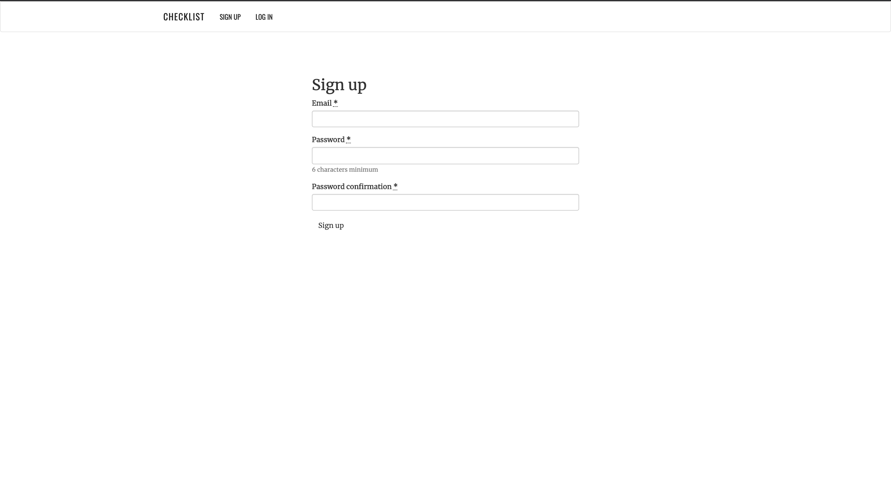
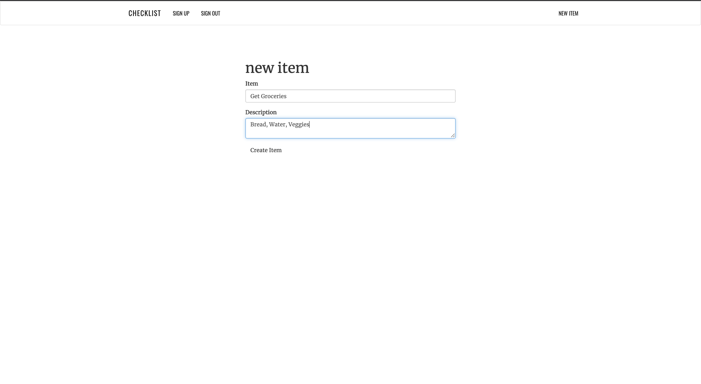
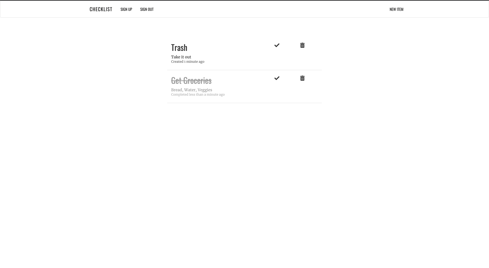

### Check List

Check list app written in Rails only. Performs all the CRUD actions (index, new/create, show, edit/update, destroy). Uses a few Ruby Gems such as Devise and Simple Form, along with Font Awesome. Written with skull tags which allow Ruby code in html.erb files. 

##### Sign up

##### Create a new item

##### Complete the item

### Let's connect. 
[LinkedIn Profile](https://www.linkedin.com/in/jamal-numan/).
